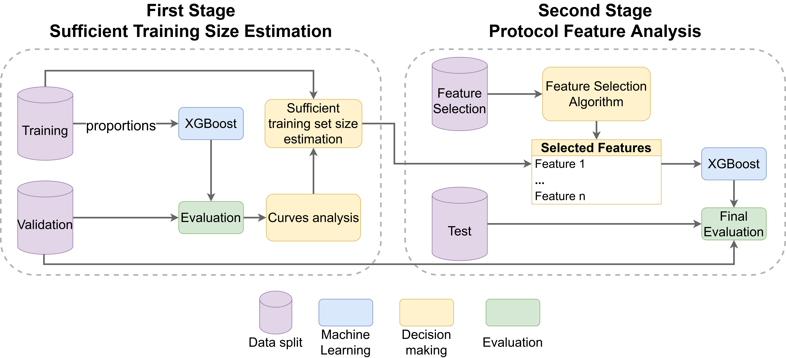

# An Efficient Multi-Stage Pipeline for IIoT Threat Detection

This repository contains all source code used for the work of "An Efficient Multi-Stage Pipeline for IIoT Threat Detection".

For more information contact: victor.shirasuna@ime.usp.br



## Table of Contents

1. [Getting Started](#1-getting-started)
    1. [Directory Organization](#directory-organization)
    2. [Configuring the BRURIIoT dataset](#configuring-the-bruriiot-dataset)
    3. [Replicating Python Environment](#replicating-python-environment)
2. [Exploratory Data Analysis (EDA)](#2-exploratory-data-analysis-eda)
3. [Running the Pipeline](#3-running-the-pipeline)
4. [Running Predictions on Raspberry Pi](#4-running-predictions-on-raspberry-pi)

## 1. Getting Started

Follow these steps to replicate our data organization and Python environment:

### Directory Organization

#### Multi-Stage Pipeline Structure

Execute the following script to create the data directories:
```shell
cd ./scripts
bash run_create_dirs.sh
```

The following directories will be created:
```
data/
├── datasets/
│   ├── splits
│   └── features
├── models/
│   ├── training_size
│   └── feature_selection
└── results/
    ├── confusion_matrix
    ├── feature_importance
    ├── inference_time
    ├── training_size
    └── feature_selection/
        ├── features
        ├── metrics
        └── pipeline
```

#### Create Folders for Raspberry Pi

Create the following folders to run on a Raspberry Pi device:
```
raspberry_pi/
├── datasets
├── models
└── results
```

### Configuring the BRURIIoT dataset

The `BRURIIoT` dataset are publicly available at the following location: https://ieee-dataport.org/documents/bruriiot-dataset-network-anomaly-detection-iiot-enhanced-feature-engineering-approach

Place the `BRUIIoT.csv` dataset file as illustrated below:
```
data/
└── datasets/
    ├── splits/
    ├── features/
    └── BRUIIoT.csv
```

> The pipeline will automatically create the necessary data splits and place at `data/datasets/splits` path.

### Replicating Python Environment

#### Install Miniforge

Install miniforge with conda version `24.9.2` and mamba version `1.5.9` from: https://github.com/conda-forge/miniforge/releases/tag/24.9.2-0

#### Create and Activate Mamba Environment

```shell
mamba create -n pipeline python=3.10.16
mamba activate pipeline
```

#### Install Pip dependencies

For the `multi-stage pipeline` environment, use the following command:
```shell
pip install -r requirements_pipeline.txt
```

For the `Raspberry Pi` environment, use the following command:
```shell
pip install -r requirements_raspberrypi.txt
```

## 2. Exploratory Data Analysis (EDA)

We conducted an Exploratory Data Analysis (EDA) of the BRURIIoT dataset to further understand its structure. All insights are available at the following notebook `notebooks/exploratory_data_analysis_eda.ipynb`.

## 3. Running the Pipeline

To execute the efficient multi-stage pipeline, simply execute the following:
> In our experiments, we used `seed` values of 0, 10, 20, 30, and 40. We also set the `n_jobs` argument to 10 using an Intel Xeon Gold 6148.
> We recommend a minimum of 32GB RAM system for using the `BRURIIoT` dataset.
```shell
cd ./scripts
python execute_pipeline.py --seed 0 --n_jobs 10
```

### Instructions

The user will be prompted to provide the **sufficient training size proportion** to proceed to the second-stage. One can analyze the plot saved at `data/results/training_size/metrics_seed{SEED}.png` image. 

To get the sufficient proportion we analyze the delta lines where all points are near to 0, meaning that no more improvements were observed. 

After, simply pass the proportion like below:
```
Which training size proportion to use? >>>0.155
``` 

## 4. Running Predictions on Raspberry Pi

Copy and paste all trained models from `data/models/feature_selection` to your Raspberry Pi environment at `raspberry_pi/models`.
> In our experiments, we used a Raspberry Pi 4 Model B with 4GB RAM running on Raspbian 64-bit OS.